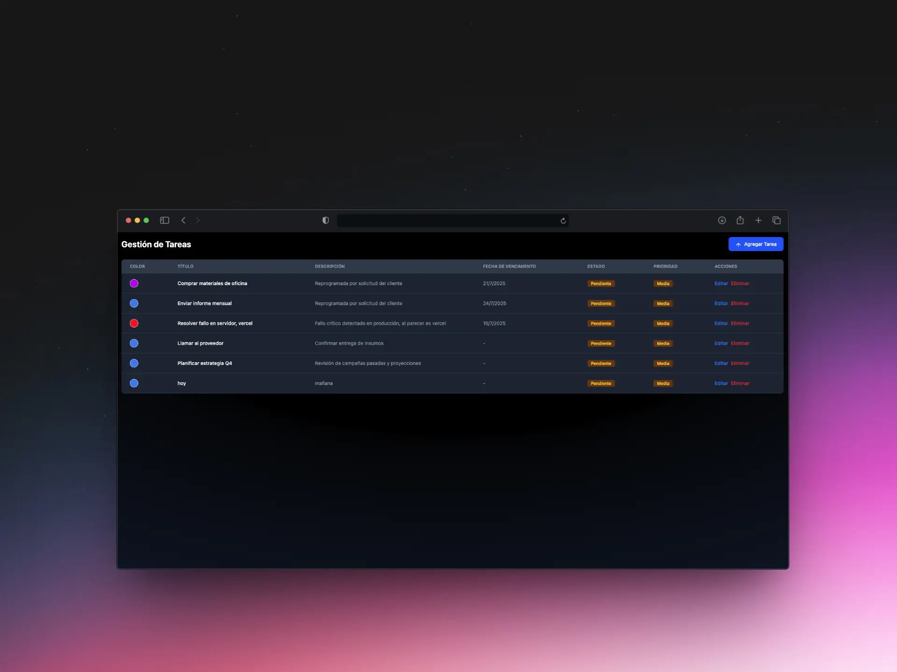

# 📝 Todo App - Frontend

Una aplicación moderna de tareas construida con **React 19** y **Vite 7** con **Tailwind CSS v4** para un desarrollo rápido y una interfaz elegante.


## 🚀 Tecnologías

- **React 19.1.0** - Biblioteca de interfaz de usuario
- **Vite 7.0.4** - Herramienta de construcción ultrarrápida
- **Tailwind CSS 4.1.11** - Framework CSS utility-first
- **ESLint** - Linter para JavaScript/React
- **Bun** - Gestor de paquetes rápido

## ⚡ Inicio Rápido

### Prerrequisitos

Asegúrate de tener instalado:
- **Node.js** (versión 18 o superior)
- **Bun** (recomendado) o **npm/yarn**

```bash
# Instalar Bun (si no lo tienes)
curl -fsSL https://bun.sh/install | bash
```

### 🛠️ Instalación

1. **Clona el repositorio:**
```bash
git clone https://github.com/JulianLlanten8/appTodo.git
cd appTodo/Frontend
```

2. **Instala las dependencias:**
```bash
# Con Bun (recomendado)
bun install

# O con npm
npm install

# O con yarn
yarn install
```

3. **Inicia el servidor de desarrollo:**
```bash
# Con Bun
bun dev

# O con npm
npm run dev

# O con yarn
yarn dev
```

4. **Abre tu navegador en:**
```
http://localhost:5173
```

## 📜 Linter

```bash
# Linting
bun run lint     # Ejecuta ESLint

# Vista previa
bun run preview  # Vista previa de la build de producción
```

## 📁 Estructura del Proyecto

```
Frontend/
├── public/
│   └── vite.svg
├── src/
│   ├── assets/
│   │   └── react.svg
│   ├── App.jsx          # Componente principal 🏠
│   ├── index.css        # Estilos globales + Tailwind 💫
│   └── main.jsx         # Punto de entrada
│   ├── components/     # Componentes reutilizables 🎲
│   │   ├── TaskForm.jsx 
│   │   ├── TaskList.jsx
│   │   └── TaskItem.jsx
│   │   └── index.jsx   # Exporta todos los componentes - Archivo de barril 🛢️
│   ├── services/          # Servicios y lógica de negocio 🔧
│   │   └── api
│       └── taskService.js  # Servicio para manejar tareas 🐕‍🦺
├── index.html           # Template HTML
├── package.json         # Dependencias y scripts
├── vite.config.js       # Configuración de Vite
├── eslint.config.js     # Configuración de ESLint
└── bun.lock            # Lock file de Bun
```


## 🤝 Contribuir

1. Fork el proyecto
2. Crea una rama para tu feature (`git checkout -b feature/nueva-feature`)
3. Commit tus cambios (`git commit -m 'Agrega nueva feature'`)
4. Push a la rama (`git push origin feature/nueva-feature`)
5. Abre un Pull Request

## 📄 Licencia

Este proyecto está bajo la Licencia MIT.

## 👨‍💻 Autor

**Julian Llanten** - [JulianLlanten8](https://github.com/JulianLlanten8)

---

⭐ **¡No olvides dar una estrella al proyecto si te fue útil!**