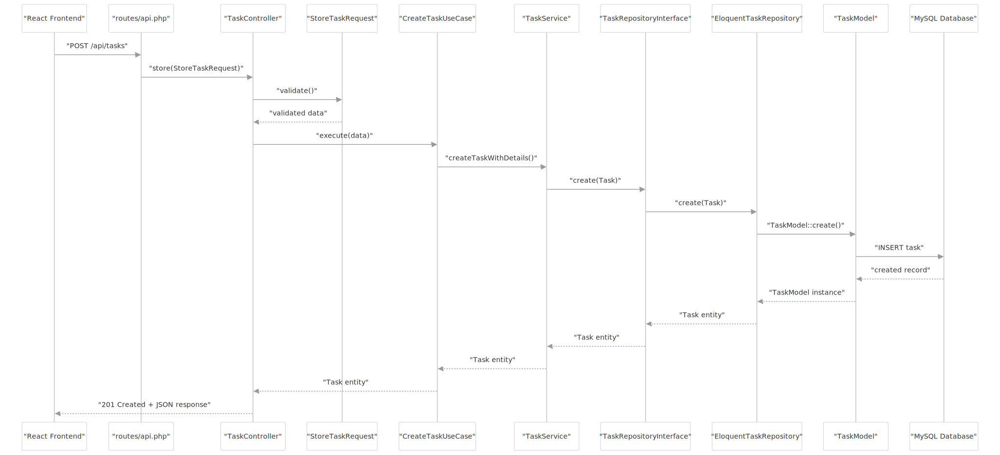

# Aplicacion para la prueba de desarrollo App todo

Una aplicacion degestion de tareas.


## Estructura de carpetas MonoRepo:
```Bash
appTodo/   
├── Backend/   //<- Laravel como API REST
├── Frontend/  //<- React SPA con Vite
```

## Hexagonal Architecture



## Request Flow Architecture



> [!IMPORTANT]
> Dentro de cada proyecto encontrara la documentacion necesaria para su despligue, recuerde seguir las intruciones.